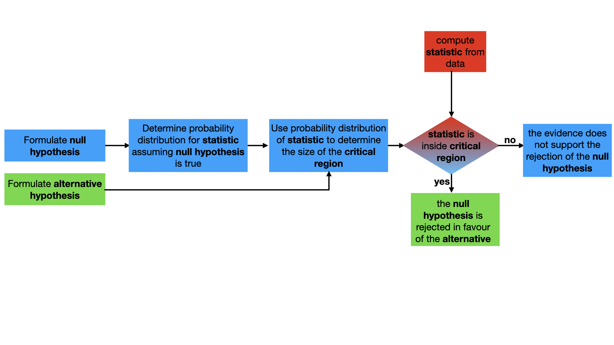

# Tests of proportion

You can now do hypothesis tests using two different types of data by following the instructions in the flow chart below:

I now want you to consider how to do a hypothesis test for the following:

_In the last census, it was found that 13% of the people living in the UK were not born here.  In a recent survey of 100 UK residents, 20 were found to have been not born here.  Does this survey provide sufficient evidence to support the belief that the proportion of people living in the UK who were not born here has changed?_ 

This question looks different from the ones you have completed in previous questions. Those exercises have, however, introduced __all__ the maths that is required to complete this task.  __With that in mind complete the functions on the cell on the left to perform the hypothesis test for a significance level of 5%.__    The functions here are similar to those that you have seen in previous exercises.  There are three key variables here though that need to be set using the information from the question above:

1. `proportion` - this variable should be set equal to the proportion of surveyed individuals who you would expect are not born in the UK under the assumption of the null hypothesis.
2. `n_non_uk_birth` - this variable should be set equal to the __statistic__ that is being used within the hypothesis test.
3. `nsurveyed` - is the number of individuals who were surveyed.
